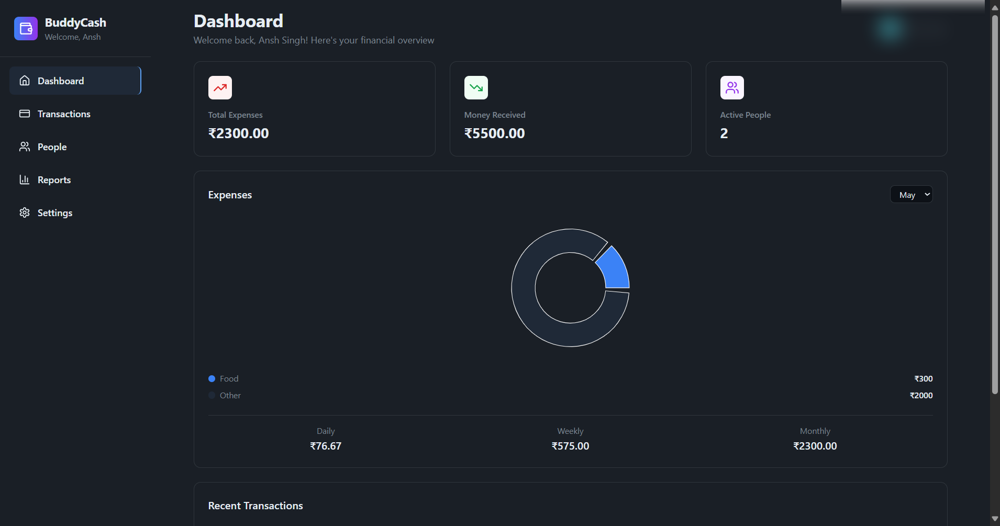
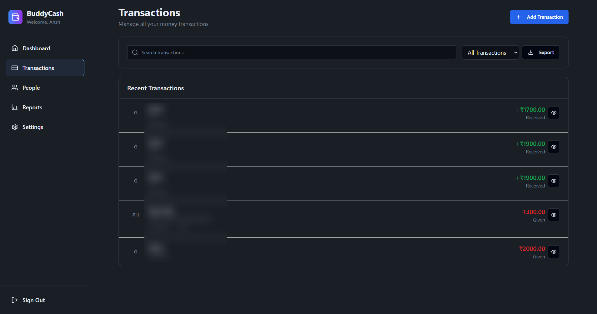

<p align="center">
  
</p>

<h1 align="center">💸 BuddyCash - Expense Tracker</h1>

<p align="center">
  <em>Track your shared and personal expenses with ease and style</em>
</p>

<p align="center">
  <a href="https://buddy-cash-tracker.vercel.app/dashboard">🌐 Live Demo</a> •
  <a href="#features">Features</a> •
  <a href="#screenshots">Screenshots</a> •
  <a href="#tech-stack">Tech Stack</a> •
  <a href="#contributing">Contributing</a>
</p>

---


---

## ✨ Features

- 📊 **Dashboard** — Overview of expenses, income, and category charts
- 💸 **Transaction Logs** — Add money given/received with tags
- 👥 **People Tracker** — Track transactions by user
- 📁 **Export** — Download transaction records
- 🌙 **Dark Mode** — Elegant, modern UI

---

## 🖼️ Screenshots

### 📊 Dashboard


### 💰 Transactions


---

## ⚙️ Tech Stack

| Layer        | Technology         |
|--------------|--------------------|
| Frontend     | React + TailwindCSS |
| Backend/Auth | Firebase or Supabase |
| Deployment   | Vercel             |

---

## 🚀 Getting Started

```bash
git clone https://github.com/your-username/buddycash.git
cd buddycash
npm install
npm run dev
